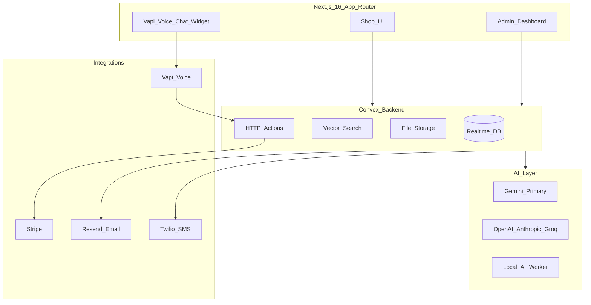

# Ecommerce — AI-Powered Full-Stack Ecommerce Platform

A production-grade ecommerce platform that combines traditional online retail with intelligent automation. Built on **Next.js 16**, **Convex**, and a multi-provider **AI layer**, it delivers realtime shopping experiences, semantic product discovery, voice commerce, AI-driven marketing, and an admin business copilot — all on a scalable, cloud-native architecture.

---

## Table of Contents

1. [AI-Powered Features](#ai-powered-features)
2. [Technology Stack](#technology-stack)
3. [Architecture Overview](#architecture-overview)
4. [Core Ecommerce Features](#core-ecommerce-features)
5. [Admin Dashboard & Operations](#admin-dashboard--operations)
6. [SMS Configuration](#sms-configuration)
7. [Future Roadmap](#future-roadmap)
8. [Portfolio Summary](#portfolio-summary)

---

## AI-Powered Features

AI is a first-class capability across the entire platform — not an add-on. From product discovery to review moderation, content generation, voice shopping, and business intelligence, every major workflow is augmented by large language models and embedding-based search.

### Semantic & Hybrid Product Search

Shoppers find products using natural language, not just exact keyword matches. The platform combines **vector similarity search** (384-dimensional embeddings) with **keyword ranking** to deliver hybrid results that understand intent — for example, "comfortable running shoes under $80" resolves category, price, and semantic meaning together.

- Product embeddings are generated via **Google Gemini** (`gemini-embedding-001`) or optional **OpenAI** embeddings
- Query embeddings are cached to reduce latency on repeat searches
- Search analytics track trending queries for merchandising insights
- Available in the storefront header, product catalog, and the Vapi voice assistant

**Key implementation:** `convex/productSearch.ts`, `convex/lib/search/hybridRank.ts`, `convex/lib/ai/productIntelligence.ts`

---

### AI Product Recommendations

The platform surfaces relevant products through multiple recommendation strategies:

- **Embedding-based similarity** — "Similar products" on product detail pages use vector distance on product embeddings
- **Product intelligence summaries** — AI-generated keywords, use cases, and summaries enrich catalog metadata for better matching
- **Voice assistant recommendations** — Vapi applies category, budget, and preference filters for conversational product suggestions
- **Bundle builder** — AI-assisted product bundles for complementary purchases

**Key implementation:** `convex/productSearch.ts` (`getSimilarProducts`), `convex/vapi/tools.ts`, `convex/vapi/bundleBuilder.ts`

---

### AI Review Intelligence

Customer reviews are analyzed automatically when submitted:

- **Sentiment analysis** — Positive, neutral, or negative classification
- **Content moderation** — Flags inappropriate or spam content before publication
- **Topic extraction** — Identifies recurring themes (quality, shipping, sizing, etc.)
- **Semantic review search** — Shoppers can search within reviews using natural language
- **Product-level insights** — Aggregated AI summaries and topic breakdowns on product pages

The review pipeline supports a **multi-provider architecture**: Gemini, OpenAI, Anthropic, Groq, or a local **AI worker** (Xenova Transformers + Ollama) for on-premise processing.

**Key implementation:** `convex/reviewAi.ts`, `convex/reviewAiActions.ts`, `convex/productReviewInsights.ts`, `services/review-ai-worker/`

---

### AI Review Reply Generation

Store administrators receive AI-drafted replies to customer reviews. The system generates context-aware responses that address specific feedback points, which admins can edit, approve, and publish — maintaining brand voice while saving hours of manual response work.

**Key implementation:** `convex/adminReviews.ts`, `convex/reviewAiActions.ts`

---

### AI Voice Assistant (Vapi)

A full **voice and chat shopping assistant** powered by **Vapi AI** enables hands-free ecommerce:

- **Product search** — Semantic and hybrid search via voice or text
- **Product selection** — Browse, compare, and add items to cart conversationally
- **Cart management** — View, update quantities, and remove items
- **Checkout** — Complete orders via Stripe or Cash on Delivery from the assistant
- **Order tracking** — Look up order status by number or customer details
- **Lead capture & support** — Collect customer inquiries and route support tickets

The assistant integrates with Convex backend tools via webhooks, with a floating widget on the storefront and a dedicated admin configuration panel.

**Key implementation:** `convex/vapi/`, `src/components/vapi/`, `src/hooks/use-vapi-assistant.ts`

---

### AI Outbound Review Calls

After order delivery, the platform can automatically place **outbound phone calls** via Vapi to collect customer reviews. The voice agent guides customers through a structured review process, capturing ratings and feedback that flow into the standard review pipeline with AI analysis.

- Configurable scheduling after delivery
- Admin dashboard for call status, retries, and collected reviews
- Integrates with Twilio for international phone number support

**Key implementation:** `convex/reviewCalls.ts`, `convex/reviewCallActions.ts`, `convex/vapi/reviewCallTools.ts`

---

### AI Product Content Generation

Administrators generate rich product content with a single click using **Gemini** (including vision for image analysis):

- **Product descriptions** — Compelling, SEO-friendly copy from product attributes and images
- **SEO metadata** — Auto-generated `seoTitle`, `seoDescription`, and `seoKeywords`
- **Product highlights** — Bullet-point feature lists for product detail pages
- **Image alt text** — Accessible alt tags derived from product image analysis
- **Batch generation** — Generate all content fields at once or individually

**Key implementation:** `convex/adminProductContent.ts`, `convex/lib/ai/productContentGeneration.ts`, `convex/lib/ai/productContentImages.ts`

---

### AI Email Marketing Campaigns

The email marketing module includes a full **AI campaign assistant** powered by Gemini:

- **Full campaign generation** — Subject lines, preview text, and HTML body from a brief prompt
- **Subject line optimizer** — A/B-style subject line suggestions for higher open rates
- **CTA and promo copy** — Call-to-action and promotional text tailored to products or categories
- **Audience segmentation** — Category-based, behavioral (recent buyers, high-value, inactive), and keyword-interest segments
- **Seasonal and category campaigns** — Templates and AI prompts for summer sales, category promotions, and more

Campaigns are sent via **Resend** with open/click tracking, revenue attribution, and batch processing for large subscriber lists.

**Key implementation:** `convex/emailCampaignAi.ts`, `convex/emailCampaigns.ts`, `convex/lib/emailSegments.ts`, `src/app/admin/(dashboard)/email-marketing/`

---

### AI Business Copilot

An **admin-only conversational intelligence layer** answers natural-language business questions:

- Revenue trends, order volume, and average order value
- Inventory and low-stock alerts
- Review sentiment and product feedback analysis
- Promotion and merchandising recommendations
- Search trend insights from customer queries

The copilot aggregates live data from orders, products, reviews, and search analytics, routes questions by intent, and responds with structured cards. Conversations and saved insights persist per admin user.

**Key implementation:** `convex/aiBusinessCopilot.ts`, `convex/lib/ai/copilotGeneration.ts`, `convex/lib/ai/businessIntelligence.ts`, `src/app/admin/(dashboard)/ai-copilot/`

---

### Multi-Provider AI Architecture

The platform is not locked to a single AI vendor. Provider selection is configurable via environment variables:

| Provider | Capabilities |
|----------|-------------|
| **Google Gemini** | Primary — chat, vision, embeddings (`gemini-2.5-flash`, `gemini-embedding-001`) |
| **OpenAI** | Chat, embeddings (`text-embedding-3-small`), moderation |
| **Anthropic** | Chat via Messages API |
| **Groq** | Fast inference via OpenAI-compatible API |
| **Local AI Worker** | Xenova Transformers (sentiment, embeddings) + Ollama (tags, replies, summaries) |

**Key implementation:** `convex/lib/ai/getProvider.ts`, `convex/lib/ai/providers/`

---

## Technology Stack

### Frontend

| Technology | Version | Purpose |
|------------|---------|---------|
| **Next.js** | 16.2.7 | App Router, SSR, API routes, middleware |
| **React** | 19.2.4 | UI components and hooks |
| **TypeScript** | 5.x | Strict type safety end-to-end |
| **Tailwind CSS** | 4.3.0 | Utility-first styling |
| **shadcn/ui** | 4.10.0 | Accessible component library (55+ components) |
| **Base UI** | 1.5.0 | Headless primitives for dialogs, popovers |
| **Framer Motion** | 12.x | Animations and transitions |
| **Recharts** | 3.x | Admin dashboard charts |
| **Embla Carousel** | 8.x | Product image galleries and carousels |
| **TipTap** | 3.x | Rich text editor for email templates |
| **Sonner** | 2.x | Toast notifications |
| **next-themes** | 0.4.x | Dark/light mode support |
| **Lucide React** | 1.x | Icon system |
| **cmdk** | 1.x | Command palette patterns |
| **react-day-picker** | 10.x | Date selection in admin |
| **react-phone-number-input** | 3.x | International phone input with validation |

### Backend

| Technology | Version | Purpose |
|------------|---------|---------|
| **Convex** | 1.40.0 | Realtime database, serverless functions, vector search, file storage |
| **Better Auth** | 1.6.9 | Authentication with email OTP |
| **@convex-dev/better-auth** | 0.12.2 | Convex integration for auth sessions |

Convex provides:
- Reactive queries that auto-update the UI on data changes
- Vector indexes for semantic search (384-dim embeddings on products and reviews)
- File storage for product images, review photos, and profile pictures
- HTTP actions for Stripe webhooks, Vapi webhooks, and auth routes
- Scheduled functions for AI processing, campaign batches, and review call scheduling

### Payments & Commerce

| Technology | Version | Purpose |
|------------|---------|---------|
| **Stripe** | 22.2.0 | Checkout Sessions, payment processing, webhooks |

### Communications

| Technology | Version | Purpose |
|------------|---------|---------|
| **Resend** | 6.12.4 | Transactional email (orders, OTP) and marketing campaigns |
| **React Email** | 6.5.0 | Type-safe email templates |
| **Twilio** | 6.0.2 | Order confirmation SMS |

### AI & Voice

| Technology | Version | Purpose |
|------------|---------|---------|
| **Google Gemini** | API | Primary LLM — chat, vision, embeddings |
| **OpenAI** | API | Optional — chat, embeddings, moderation |
| **Anthropic** | API | Optional — chat |
| **Groq** | API | Optional — fast inference |
| **Vapi** | 2.5.2 | Voice and chat shopping assistant |
| **Xenova Transformers** | — | Local sentiment analysis and embeddings |
| **Ollama** | — | Local LLM for tags, replies, summaries |

### DevOps & Tooling

| Technology | Purpose |
|------------|---------|
| **Vercel** | Production hosting with preview deployments |
| **ESLint** | Code quality with Next.js and Convex rules |
| **npm-run-all** | Parallel dev servers (Next.js + Convex) |
| **Docker Compose** | Optional local AI worker container |

---

## Architecture Overview

**Data flow highlights:**

- **Shop frontend** subscribes to Convex queries — catalog, cart, and order updates appear instantly without polling
- **Admin dashboard** reads aggregated KPIs, manages products/orders, and triggers AI workflows
- **Vapi assistant** calls Convex HTTP endpoints as tools for search, cart, checkout, and tracking
- **Stripe webhooks** hit Convex HTTP routes for payment verification and order fulfillment
- **AI actions** run as Convex actions (Node.js) calling external LLM APIs, with results stored via mutations

---

## Core Ecommerce Features

### Product Management

A full-featured product catalog with admin CRUD and rich merchandising controls.

#### Product CRUD

- Create, read, update, and soft-delete (deactivate) products from the admin panel
- Paginated product lists with search, filters, and column visibility controls
- Public catalog with infinite-scroll pagination, grid/list views, and sort options
- Realtime updates — catalog changes propagate instantly to all connected browsers

#### Categories

- Hierarchical category management with name, description, slug, and sort order
- Active/inactive toggle per category
- Product count per category for merchandising decisions
- Drag-and-drop reorder support in admin

#### Product Images

- Multiple images per product stored in **Convex file storage**
- Secure upload URLs generated server-side
- Image gallery with carousel on product detail pages
- AI-generated alt text for accessibility and SEO

#### Product Variants

- Color options per product (configurable color array)
- Size selection on order line items where applicable
- Variant selection flows through cart and checkout with price snapshots

#### Product Status

- **Active** products appear in the public catalog
- **Inactive** products are hidden from shoppers but retained in admin for restoration
- Admin tabs for quick filtering between active and inactive inventory

#### Featured Products

- **Featured** flag for homepage hero sections
- **Best Sellers** and **New Arrivals** merchandising flags
- Manual reorder for curated product placement
- Discounted products list for promotional sections

#### Discount Management

- Per-product **discount percentage** with automatic final price calculation
- Line-level discount snapshots on orders for accurate historical pricing
- Cart pricing hook computes totals with discounts and shipping in realtime

#### Shipping Charges

- Per-product **shipping flag** and **shipping charges** amount
- Shipping costs roll up in cart and checkout order summaries
- Configurable per product for mixed free-shipping and paid-shipping catalogs

#### SEO Metadata

- `seoTitle`, `seoDescription`, and `seoKeywords` fields per product
- Admin form with character-count warnings for optimal SEO length
- JSON-LD structured data on the homepage for search engine rich results
- AI-generated SEO content from product attributes

#### Product Highlights

- Bullet-point highlight arrays for product detail pages
- AI-generated highlights from product name, description, and images
- Displayed prominently on single product views

#### Additional Product Features

- **Stock / inventory** tracking with decrement on checkout and restore on cancellation
- **Low-stock alerts** on admin dashboard with configurable threshold
- **Brand filtering** via the `company` field with brand list query
- **SKU** field for internal inventory reference
- **Multi-currency** support at product level

---

### Checkout & Payments

A secure, multi-method checkout flow supporting both online and offline payment.

#### Cash On Delivery (COD)

- Customers select COD at checkout with no online payment required
- Orders created immediately with `pending` payment status
- Admin can update COD payment status (pending → paid) upon delivery collection
- Full order lifecycle independent of payment gateway

#### Stripe Checkout

- **Stripe Checkout Sessions** for secure card payments
- Pending order created before redirect to Stripe hosted checkout page
- Success and cancel pages with order confirmation details
- Supports Stripe's built-in payment methods and fraud protection

#### Secure Payment Processing

- Server-side session creation — no card data touches the application
- Idempotency keys prevent duplicate orders on retry
- Cart validation against live product prices and stock before order creation

#### Payment Verification

- **Stripe webhooks** verify payment completion server-side
- Webhook signature validation prevents spoofed events
- Idempotent event log (`stripeWebhookEvents`) prevents duplicate processing
- Payment status updated atomically with order status

#### Stripe Webhooks

- HTTP endpoint at `/stripe/webhook` on Convex site URL
- Handles `checkout.session.completed`, payment intent events, and refunds
- Automatic order confirmation emails and SMS triggered on successful payment

#### Order Creation

- Order document with customer info, totals, payment method, and status
- Order line items with **price snapshots** (original price, discount, final price)
- Order status logs and payment logs for full audit trail
- Customer profile persistence by email for faster repeat checkout

#### Payment Status Tracking

- Payment statuses: `pending`, `paid`, `failed`, `refunded`
- Visible in admin order detail and public order tracking
- Payment log entries record actor (system, admin, webhook) and timestamp

#### Post-Checkout Notifications

- Order confirmation email via Resend with React Email template
- Optional order confirmation SMS via Twilio (admin-configurable toggle)
- Review invitation emails sent from admin after delivery

#### Voice Checkout

- Vapi assistant can initiate Stripe or COD checkout from conversational cart
- Stripe checkout link delivered in chat for secure payment completion

---

### Order Management

End-to-end order lifecycle from placement to delivery with full visibility for admins and customers.

#### Order Creation

- Triggered by COD submission or Stripe webhook confirmation
- Inventory decremented atomically with stock assertion
- Unique order numbers generated for customer reference
- Idempotent creation prevents duplicates from network retries

#### Order Status Tracking

Full fulfillment lifecycle:

| Status | Description |
|--------|-------------|
| `pending` | Order placed, awaiting processing |
| `processing` | Being prepared for shipment |
| `confirmed` | Order confirmed by store |
| `shipped` | Dispatched to customer |
| `delivered` | Successfully delivered |
| `cancelled` | Cancelled by admin or customer |
| `refunded` | Payment refunded |
| `failed` / `expired` | Payment or checkout failures |

Status changes logged with actor (system, admin, customer) and timestamp.

#### Payment Status Tracking

- Separate payment status from fulfillment status
- COD orders track collection separately from shipping progress
- Stripe orders auto-update to `paid` on webhook confirmation

#### Customer Information

- Name, email, phone, and full shipping address captured at checkout
- Customer profiles saved by email for pre-filled repeat purchases
- Phone numbers validated to E.164 format for SMS delivery

#### Order History

- Admin paginated order list with filters by status, payment method, date range, and amount
- Sort by newest, oldest, highest amount, or lowest amount
- Order detail view with line items, pricing breakdown, status timeline, and payment logs

#### Public Order Tracking

- Customers track orders at `/track-order` without logging in
- Lookup by **order number** or **email/phone**
- Rate limiting prevents abuse
- Progress timeline visualization with current status
- Dedicated URL per order: `/track-order/[orderNumber]`

---

### Customer Features

Engagement tools that build trust and drive repeat purchases.

#### Product Reviews

- **Verified-purchase reviews** tied to delivered order items
- Star rating (1–5), title, and text with optional image uploads
- Review eligibility check ensures only purchasers can review
- Create, update, and delete own reviews from order history
- Admin moderation workflow (approve/reject) before public display

#### Product Ratings

- Aggregate star rating and review count on product cards and detail pages
- Rating breakdown visualization (5-star distribution)
- Ratings update automatically when reviews are approved

#### Review Management

- Admin review inbox with filters by status, sentiment, and product
- AI retry for failed analysis pipelines
- Helpful vote system with voter deduplication
- Homepage testimonials surfaced from top approved reviews

#### Order Tracking

- Public order tracking page (see Order Management above)
- Order-delivered review prompts on tracking page
- Email review invitations sent from admin

#### Newsletter Subscription

- Footer newsletter signup on every page
- Token-based unsubscribe at `/unsubscribe/[token]`
- Admin subscriber management with export to CSV
- Subscriber interests detected from purchase behavior for segmentation

#### Contact Form

- Public contact page with validated form submission
- Admin inbox with read/unread status and delete
- Store contact info (address, phone, email, hours) from settings displayed on contact page

#### Static Pages

- About page with company story, stats, and FAQ
- Terms of Service and Privacy Policy pages
- JSON-LD and SEO metadata for discoverability

---

## Admin Dashboard & Operations

A comprehensive command center for store operators.

### Dashboard KPIs & Analytics

- **Revenue**, **order count**, and **average order value** with period-over-period comparison
- Time-range filters (today, 7 days, 30 days, 90 days, custom)
- Revenue trend chart (Recharts)
- Order status and payment method breakdowns
- Top products and top categories by sales
- Review analytics (sentiment distribution, pending moderation count)

### Operational Alerts

- **Low-stock alerts** with configurable threshold from settings
- Recent orders feed with quick navigation to detail
- Admin activity feed from audit logs

### User Management

- Better Auth with email OTP login
- Role-based access: `admin` and `superAdmin`
- User CRUD: create, ban, role assignment
- Profile management with avatar upload and password change

### Settings

- Store contact information, business hours, and policies
- Email from-address configuration with Resend sync
- SMS order confirmation toggle
- Review call scheduling configuration
- Custom system settings extensible via key-value store

### Email Marketing Hub

- **Templates** — Rich text editor (TipTap), product linking, draft/published workflow, duplicate
- **Campaigns** — Create, schedule, send, batch processing, open/click/revenue stats
- **Subscribers** — List, segment, export, interest detection
- **AI Assistant** — Campaign generation, subject optimizer, CTA suggestions
- Marketing dashboard KPIs for campaign performance

### Review Operations

- Review moderation queue with AI sentiment and moderation flags
- AI reply draft generation and publish workflow
- Review call management — schedule, retry, view collected reviews
- Vapi conversation panel for assistant interaction logs

### AI Assistant Configuration

- Vapi assistant setup and webhook configuration
- Admin panel for monitoring voice/chat sessions
- Production setup scripts for Vapi deployment

---

## SMS Configuration

Transactional SMS keeps customers informed without marketing spam.

### Twilio Integration

- Order confirmation SMS sent automatically after successful order placement
- Message includes order number and key details
- Credentials configured via environment variables (`TWILIO_ACCOUNT_SID`, `TWILIO_AUTH_TOKEN`, `TWILIO_PHONE_NUMBER`)

### Admin Configuration

- **SMS Order Confirmation** toggle in Admin → Settings
- When disabled, only email notifications are sent
- Public settings API respects toggle for notification orchestration

### Phone Validation

- Customer phone numbers validated to **E.164** international format via `libphonenumber-js`
- Invalid numbers skip SMS gracefully without blocking order creation
- Configurable max message length for trial vs. paid Twilio accounts

### Scope

SMS is limited to **transactional order confirmations**. SMS marketing, OTP via SMS, and promotional texts are not implemented — admin OTP uses email via Resend.

---

## Future Roadmap

The following capabilities are **planned** for future development and are not yet implemented:

| Feature | Description |
|---------|-------------|
| **AI Inventory Forecasting** | Predict stock demand from sales velocity, seasonality, and trends to prevent stockouts and overstock |
| **AI Dynamic Pricing** | Real-time price optimization based on demand, competition, and inventory levels |
| **AI Customer Segmentation** | Automated RFM and behavioral clustering for targeted marketing |
| **AI Sales Forecasting** | Revenue and order volume predictions for business planning |
| **AI Promotion Optimization** | A/B test and optimize discount strategies, timing, and audience targeting |
| **Advanced Analytics** | Cohort analysis, funnel visualization, customer lifetime value, and attribution modeling |

---

## Portfolio Summary

**Yasir Ecommerce** is a modern AI-powered ecommerce platform that combines traditional online retail functionality with intelligent automation at every layer of the stack. Built on **Next.js 16** and **Convex**, it delivers realtime catalog updates, semantic product search powered by **Gemini embeddings**, and a **Vapi voice assistant** that handles the full shopping journey — from product discovery to checkout and order tracking.

On the operations side, an **AI Business Copilot** gives store administrators natural-language access to revenue, inventory, and review analytics, while **AI email marketing** generates campaigns with behavioral segmentation. Customer reviews are enriched with sentiment analysis, topic extraction, and AI-generated reply drafts, and **outbound review calls** collect feedback proactively after delivery.

The platform integrates **Stripe** for secure payments, **Resend** for transactional and marketing email, and **Twilio** for order confirmation SMS — all orchestrated through Convex serverless functions with webhook verification, audit logging, and idempotent processing. A multi-provider AI architecture (Gemini, OpenAI, Anthropic, Groq, local worker) ensures flexibility and cost control.

Whether evaluated by recruiters, clients, investors, or portfolio visitors, this project demonstrates end-to-end full-stack engineering: reactive backend design, production payment flows, voice commerce, embedding-based search, and AI-augmented business intelligence — unified in a single scalable, cloud-native application deployed on **Vercel** with **Convex** as the realtime data layer.

---

*For development setup and environment configuration, see the project [README.md](../README.md).*
